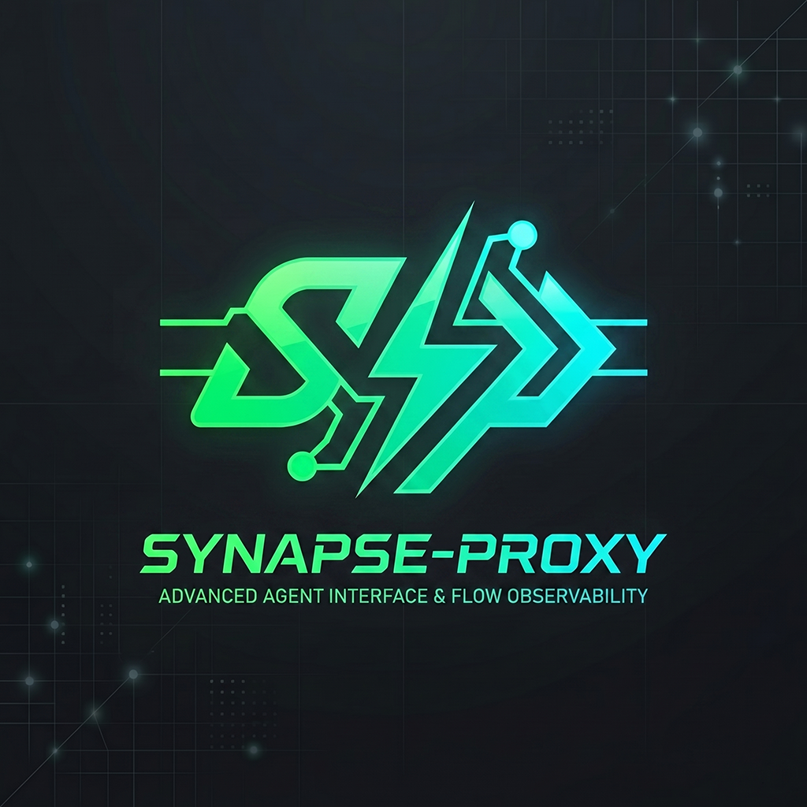
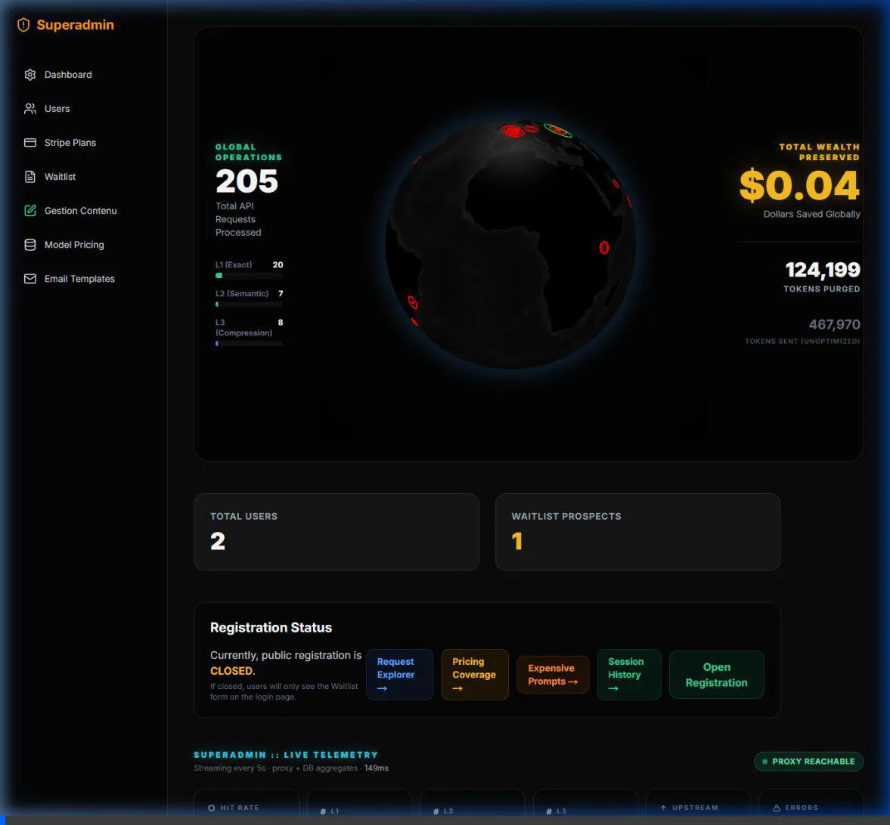

<p align="center">
  
</p>

<p align="center">
  <a href="https://synapse-proxy.com"></a>
  
  
  
  
  
  
</p>

<h1 align="center">Synapse Proxy: The Ultimate Agentic Firewall & Deep Telemetry Gateway</h1>

> **A drop-in, open-source proxy that brings military-grade observability, security, and smart caching to your autonomous AI agents.**

Synapse Proxy sits gracefully between your application and any OpenAI-compatible LLM provider. Its primary mission is to empower developers with **Deep Agentic Observability** and a **Smart Firewall**, keeping rogue agent loops in check, protecting sensitive data, and making multi-turn LLM interactions entirely visible and measurable.

<p align="center">
  
</p>

While it actively protects your infrastructure and monitors your agents' intents, Synapse Proxy quietly optimizes token usage in the background with a four-tier cache pipeline (L0 to L3), ensuring you never pay twice for the same agentic thought process.

**Version française** : [README_FR.md](README_FR.md)

---

## 🛡️ Agentic Firewall & Security

When building autonomous agents (AutoGPT, LangChain, custom loops), the biggest risk is infinite loops, runaway costs, and prompt injections. Synapse Proxy introduces a robust Firewall specifically designed for AI agents:

- **Loop Kill Switch & Self-Correction:** Detects when an agent is drifting into an infinite loop (repeating identical tool payloads). It intercepts the execution and returns a mock OpenAI-compatible chat completion response (`HTTP 200`) containing a descriptive self-correction warning to guide the agent to change strategy without crashing the process.
- **Tool Allowlisting & Fingerprinting:** Lock down your agent's capabilities. If an agent hallucinates a tool or tries to invoke an unauthorized function, the Proxy actively blocks the request.
- **Granular Tool Cache TTLs:** Configure custom cache durations per tool name (including setting TTL to 0s to disable caching for specific stateful tools).
- **PII Redaction:** Native regex-based masking of sensitive data (Emails, API Keys, Phone Numbers) before the prompt ever reaches the upstream provider.
- **Session Circuit Breaker:** Define strict prompt-token limits per session to cap expenditures on a per-task basis.

---

## 📊 Deep Telemetry & Intent Observability

Every request is persisted to a PostgreSQL database, turning black-box agent behavior into a transparent, analyzable flow via our stunning Next.js Control Plane.

- **Local AI Intent Classification:** We use `@xenova/transformers` (running locally, 100% offline) to asynchronously classify every prompt intent (`coding`, `rag`, `chat`, `extraction`) without adding a single millisecond of latency to the critical proxy path.
- **Session Replay Timeline:** Inspect agent interactions step-by-step. Reconstruct the agent's flow, tool calls, and payload latency across a unified visual timeline.
- **System Prompt Diffing:** Agents sometimes rewrite their own instructions mid-session. The proxy extracts and diffs the system prompt, highlighting exactly what changed in the dashboard.
- **Context Window Tracker:** A dynamic graph comparing the *Original Prompt Tokens* against the *L3 Compressed Tokens* over time, demonstrating exactly how context grows and how Synapse Proxy mitigates it.
- **A/B Benchmark:** Toggle benchmark mode to fire control and optimized requests in parallel, using an LLM judge to score response similarity.

<p align="center">
  
</p>

---

## ⚡ Cost Optimization as a Bonus

Though security and observability take center stage, Synapse Proxy features a state-of-the-art caching engine designed to minimize latency and token waste.

- **Drop-in OpenAI replacement:** No SDK changes required. Just point your client at `http://<host>:8080/v1` with an `Authorization: Bearer sk-opti-...` virtual key. The proxy speaks OpenAI chat completions on the wire to the client; the upstream is selectable per virtual key.
- **Three-tier cache pipeline (L1/L2/L3):**
  - **L1 Exact Match:** SHA-256 hash of the post-L3 payload, byte-stable. Identical requests hit the cache in O(1).
  - **L2 Semantic Match (Jaccard ≥ 0.85):** Word-level Jaccard similarity on the system prompt. Catches "the system prompt is the same but the user message is different" cases.
  - **L3 Relaxed Semantic Match (Jaccard ≥ 0.70):** Jaccard on the system prompt or the last user message. Catches light paraphrases.
  - L2 and L3 use Jaccard, not ONNX vector search. This is by design: it's fast (no embedding model load), deterministic, and works on small prompts. For deeper semantic match, the upstream provider's own prompt cache (Anthropic, OpenAI, MiniMax) is the better lever — see the Anthropic endpoint section below.
- **L3 Byte-Preserving Compression:** Intelligently prunes stale `<thinking>`, `<thought>`, and `<scratchpad>` blocks from non-recent assistant messages; truncates tool outputs over 200 characters; blanks the content of repeated (3rd+) same-name tool results. **The prefix stays byte-identical**, which is what allows the upstream provider's native prompt cache to keep hitting from turn 2 onwards.
  - **Todo-list carve-out:** Any tool payload whose content begins with a `status: pending` / `status: in_progress` / `todos: [...]` anchor is preserved verbatim, so multi-turn agents (Hermes, OpenClaw) keep their plan visible across turns. Validated end-to-end with Hermes-style payloads in production: **44.7% of the body bytes saved on a realistic multiturn payload, while the prefix stays byte-stable**.
- **Anthropic / `v1/messages` endpoint translator:** When a virtual key is configured with `use_anthropic_endpoint=true` and the provider is `minimax`, `deepseek`, `bedrock`, or `vertex`, the proxy translates the OpenAI-shape request into the Anthropic `/v1/messages` format (system message hoisting, content block conversion, tool_use/tool_result mapping, max_tokens defaulting) and forwards it to the provider's Anthropic-compatible endpoint. The response is translated back to OpenAI shape on the way out. The Anthropic `cache_read_input_tokens` counter is exposed as `cached_tokens` in the OpenAI `prompt_tokens_details` block. On MiniMax this activates their prompt cache, which we measured at **>99% cache hit ratio** on byte-stable prefixes after the first request.
- **Cache level telemetry:** When the L3 byte-preserving pipeline actually shrinks the payload, the `RequestLog` row is tagged `cacheLevel='L3'` with non-zero `inSaved` / `outSaved` / `costSaved`. A one-time backfill of 125 historical rows (from before the byte-stable compressor shipped) was run in production to correct the labels.

### Caveats and design notes

- The "prefix byte-stable" guarantee requires the proxy to be the *only* writer of the prefix. If you inject a request with re-ordered keys, a different system prompt, or extra `cache_control` blocks, the prefix is no longer byte-stable and the upstream cache misses. The proxy preserves the original key order and whitespace.
- The `L3` cache label in the dashboard is set on the byte-preserving compression path only. CCR semantic cache hits still get `L3`, but they go through the Jaccard / SHA-256 paths described above.
- The local-client (standalone `synapse-local.exe`) ships the same byte-preserving L3 + Anthropic translator pipeline as the SaaS, with SQLite replacing Redis. See `local-client/README.md`.

<p align="center">
  
</p>

---

## 🔌 MCP Server (Model Context Protocol)

Synapse Proxy doubles as a robust MCP server, exposing **17 specialized tools** directly to your IDE (Cursor, Claude Code, Continue, etc.).

All tools are completely free to use locally or on your self-hosted stack. In-process execution of `synapse_chat_completions` runs completely in-memory using `httptest.NewRecorder()`, eliminating loopback HTTP dependencies and allowing the MCP server to run completely offline in stdio mode (`--mcp`).

The newly integrated tools include:
* **`synapse_inspect_ccr_store`**: Lists all keys and payload sizes currently archived in the L3 CCR store.
* **`synapse_get_ccr_value`**: Retrieves the original uncompressed payload for a given CCR hash key.
* **`synapse_optimize_prompt`**: Simulates the prompt optimization hooks locally and returns the compressed payload and alerts without making LLM calls.

```bash
# Stdio mode (recommended for local Cursor/IDE integrations)
./synapse-proxy --mcp --mcp-tier=full

# HTTP SSE mode (for remote/multi-user server setup)
./synapse-proxy --mcp-http --mcp-http-port=8081 --mcp-tier=full --dashboard-url=http://localhost:3000
```

> 📖 **Deep Dive:** Read the [Model Context Protocol (MCP) Guide](docs/mcp_server.md) for the complete list of all tools, parameter schemas, and IDE setup details.

---

## 💻 The Dashboard (Next.js) — 100% Open Source

The repo ships with a complete Next.js dashboard under `./dashboard` that turns the proxy's raw telemetry into an actionable control plane. **It is fully open source under the same MIT license as the proxy**: audit it, fork it, self-host it, theme it — there is no closed-source SaaS-only path.

| Feature | Description |
|---------|-------------|
| **Live Telemetry** | See every request arrive via SSE. Rows that share a conversation automatically group together using a conversation signature. |
| **Global Command Center** | A stunning 3D/HUD interface showing real-time token flows, cache hit rates, and live server health. |
| **Agent Firewall Modal** | Toggle L1/L2/L3 caches, kill switch, PII redaction, session token limits, and tool allow-lists per virtual key. Changes sync to Redis instantly. |
| **Playground v3** | Side-by-side A/B chat: same prompt twice in parallel, once through the proxy, once directly upstream. Includes an artifact renderer. |
| **Admin Panel** | Self-host the whole product: manage virtual keys, dynamic model pricing, user management, alert rules, and Stripe billing. |

### Architecture

```
dashboard/
├── app/                        # Next.js App Router (React Server Components)
├── components/                 # LiveTelemetryGrouped, FirewallModal, TokenFlowAnimation, etc.
├── lib/                        # authOptions, prisma, stripe, email
├── prisma/                     # PostgreSQL schema & migrations
└── .env.example                # Configuration template
```

The dashboard reads from the same Postgres + Redis instances as the proxy, so a self-hosted deployment has **one database to back up**.

---

## 🚀 Getting Started

### 1. Self-Host via Docker Compose
Clone the repository and spin up the entire stack (Proxy, Postgres, Redis, Next.js Dashboard, Caddy) in one command:

```bash
git clone https://github.com/yourusername/synapse-proxy.git
cd synapse-proxy

# Copy the example environment variables
cp .env.example .env

# Build and start the stack
docker compose -f docker-compose.prod.yml up -d --build
```

### 2. Quickstart (Client Code)
Once your proxy is running, changing your code is as simple as updating the `baseURL` and `apiKey`:

```python
from openai import OpenAI

client = OpenAI(
    base_url="http://localhost:8080/v1", # Point to Synapse Proxy
    api_key="sk-opti-..."                # Use your Synapse Virtual Key
)

response = client.chat.completions.create(
    model="gpt-4o",
    messages=[{"role": "user", "content": "Hello!"}]
)
```

---

## 📄 License

Synapse Proxy is **fully open source under the MIT License** — proxy, dashboard, and SDKs alike. Self-host the whole stack, audit every line, fork whatever you need. 

We offer a managed SaaS at [synapse-proxy.com](https://synapse-proxy.com) for teams that prefer not to operate Postgres + Redis themselves; the hosted version runs the exact same code as this repo. The SaaS is a **convenience**, not a gatekeeper.
