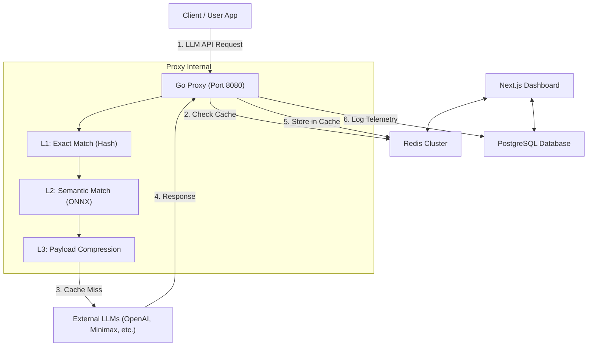

# OptiToken Architecture

OptiToken is designed as a high-performance, cost-saving proxy for LLM APIs (OpenAI, Anthropic, Gemini, DeepSeek, Minimax, etc.). It intercepts API requests and uses a multi-tiered caching system to dramatically reduce API costs and latency.

## High-Level System Architecture

## The 4-Tier Optimization System

OptiToken relies on a highly efficient pipeline:

### L0 Cache: Request Deduplication
Before doing any complex processing, if multiple identical requests arrive at the exact same millisecond, they are collapsed into a single outbound request to prevent rate limits.

### L1 Cache: Exact Hash Matching
Calculates an xxHash of the request payload. If a perfectly identical request exists in Redis, it is returned instantly (<2ms latency). Cost saved: 100%.

### L2 Cache: Semantic Vector Matching
Powered by a local ONNX model (`paraphrase-multilingual-MiniLM-L12-v2`), OptiToken extracts the text content of the request and converts it into a 384-dimensional vector. It searches Redis using `FT.SEARCH` for semantically similar previous requests.
- Tolerance: Adjustable by the user (default `0.15` Cosine Distance).
- Useful for cross-lingual matches or variations like: "How to run Python?" vs "Comment exécuter un script Python ?".
- Cost saved: 100%.

### L3 Cache: Payload Compression
If there is a Cache Miss in L1 and L2, the payload is sent to the LLM. However, before sending, OptiToken strips unnecessary whitespace, minifies JSON, and removes redundant tokens, safely shrinking the request size.
- Cost saved: 5-15% per request.

### Accurate Tokenization
OptiToken relies on `tiktoken-go` (BPE OpenAI `cl100k_base` encoding) directly within the Go proxy to perfectly measure input/output token usage for analytics.

### Smart Fallbacks
Keys can be configured with a Fallback Provider. If an LLM is down or rate-limiting (e.g. 429/500/408 HTTP errors), OptiToken transparently retries with an exponential backoff before cleanly failing over to the backup provider without breaking the client.

## Tech Stack
- **Proxy**: Go (Golang) for extremely high concurrency, low latency, and accurate `tiktoken` counting.
- **Semantic Engine**: Python FastAPI wrapping ONNX Runtime (`sentence-transformers`).
- **Cache**: Redis Stack (with RedisSearch for vector similarity).
- **Dashboard**: Next.js 14, React, Tailwind CSS, Prisma, PostgreSQL.
- **Analytics Export**: CSV Generation through backend routes.
- **Playground**: Side-by-Side A/B visualizer testing Control vs OptiToken streams.
- **Authentication**: NextAuth with custom credentials (JWT).
- **Billing**: Stripe Checkout (Webhooks synced).
- **Email**: Nodemailer (SMTP).
