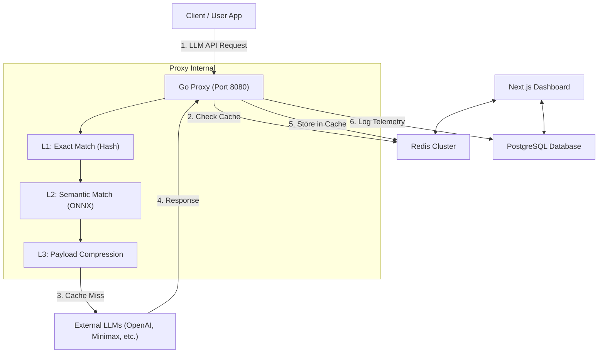

# OptiToken Architecture

OptiToken is designed as a high-performance, cost-saving proxy for LLM APIs (OpenAI, Anthropic, Gemini, DeepSeek, Minimax, etc.). It intercepts API requests and uses a multi-tiered caching system to dramatically reduce API costs and latency.

## High-Level System Architecture

## The 4-Tier Optimization System

OptiToken relies on a highly efficient pipeline:

### L0 Cache: In-flight Request Deduplication
When two identical requests arrive at the proxy at the same time (same SHA-256 payload hash + same virtual key), the first one acquires a Redis `SETNX` lock with 30s TTL (`optitoken:l0:lock:<vk>:<sha>`), processes normally, and **publishes** its response to `optitoken:l0:resp:<vk>:<sha>` (also TTL 30s) when done. The second (and any further) request **blocks and polls** the response key every 50ms until it appears, then returns the same response with header `X-OptiToken-Cache: L0-coalesced`.

The lock release is done via a Lua script that only deletes the key if the value matches the worker's UUID, so an expired worker cannot accidentally release another worker's lock.

L0 is **skipped for streaming** requests (the client already started receiving the stream). Followers are tagged in the telemetry as `cacheLevel=L0` with `promptTokensOrig=0, promptTokensOpt=0` because they did no work.

### L1 Cache: Exact Hash Matching
Calculates a SHA-256 of the request payload. If a perfectly identical request exists in Redis, it is returned instantly (<2ms latency). Cost saved: 100%.

### L2 Cache: Semantic Vector Matching
Powered by a local ONNX model (`paraphrase-multilingual-MiniLM-L12-v2`), OptiToken extracts the text content of the request and converts it into a 384-dimensional vector. It searches Redis using `FT.SEARCH` for semantically similar previous requests.
- Tolerance: Adjustable by the user (default `0.15` Cosine Distance).
- Useful for cross-lingual matches or variations like: "How to run Python?" vs "Comment exécuter un script Python ?".
- Cost saved: 100%.

### L3 Cache: Payload Compression
If there is a Cache Miss in L1 and L2, the payload is sent to the LLM. However, before sending, OptiToken strips unnecessary whitespace, prunes stale Chain-of-Thought (`<thought>`) logs, deletes `reasoning_content` from old assistant turns (DeepSeek-R1, Qwen QwQ, etc.), and minifies huge JSON tool outputs (truncating tool results >200 chars to a head + `[…truncated by OptiToken L3…]` marker).

The compressed payload is only used as the upstream request if it actually **shrinks** in both bytes AND tokens — otherwise the original payload is sent untouched (no re-encoding inflation). Tool outputs that would otherwise look like prompt-injection attempts (`_opti_pruned`, `compacted_repeated_tool`, etc.) are simply truncated, never replaced with synthetic stubs, so the agent's safety filter doesn't reject them.
- Cost saved: 5-15% per request.

### Accurate Tokenization
OptiToken relies on `tiktoken-go` (BPE OpenAI `cl100k_base` encoding) directly within the Go proxy to perfectly measure input/output token usage for analytics.

### Smart Fallbacks
Keys can be configured with a Fallback Provider. If an LLM is down or rate-limiting (e.g. 429/500/408 HTTP errors), OptiToken transparently retries with an exponential backoff before cleanly failing over to the backup provider without breaking the client.

## Tech Stack
- **Proxy**: Go (Golang) for extremely high concurrency, low latency, and accurate `tiktoken` counting.
- **Semantic Engine**: Python FastAPI wrapping ONNX Runtime (`sentence-transformers`).
- **Cache**: Redis Stack (with RedisSearch for vector similarity).
- **Dashboard**: Next.js 14, React, Tailwind CSS, Prisma, PostgreSQL.
- **Analytics Export**: CSV Generation through backend routes.
- **Playground**: Side-by-Side A/B visualizer testing Control vs OptiToken streams.
- **Authentication**: NextAuth with custom credentials (JWT).
- **Billing**: Stripe Checkout (Webhooks synced).
- **Email**: Nodemailer (SMTP).
