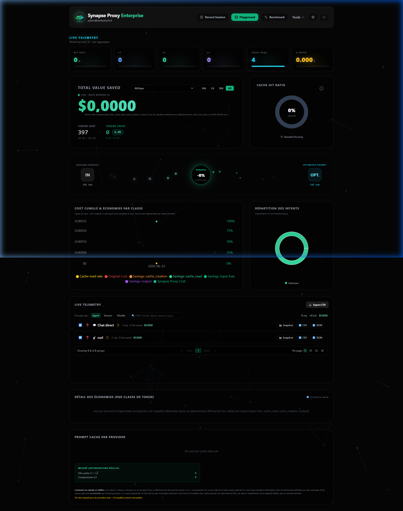
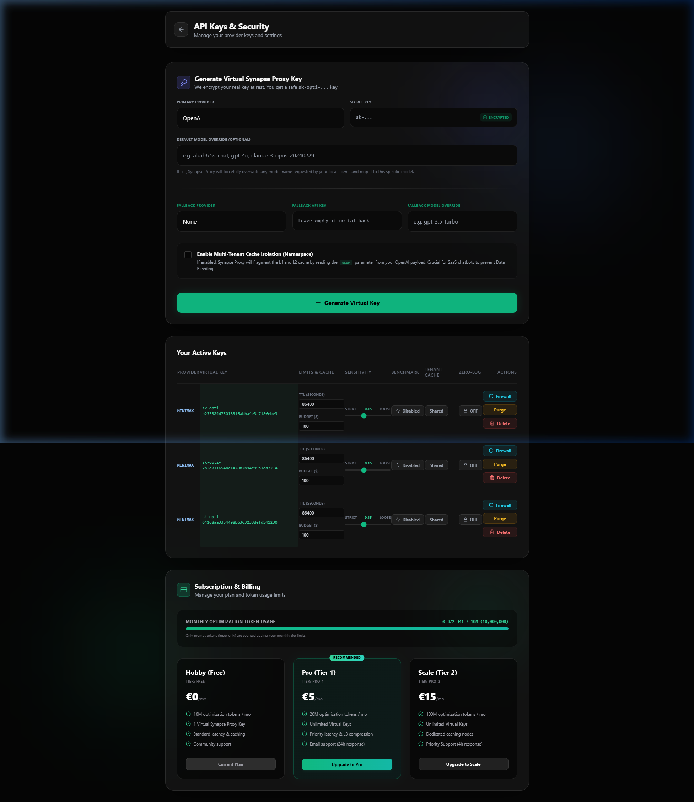
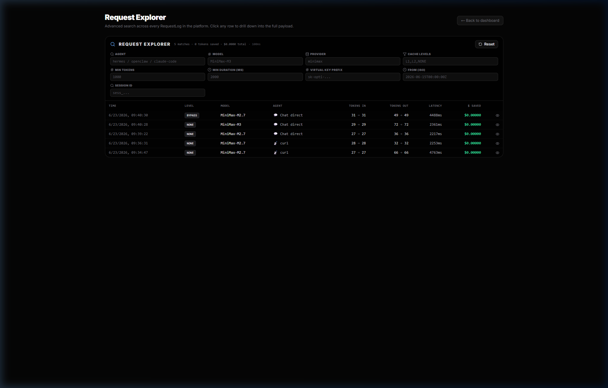
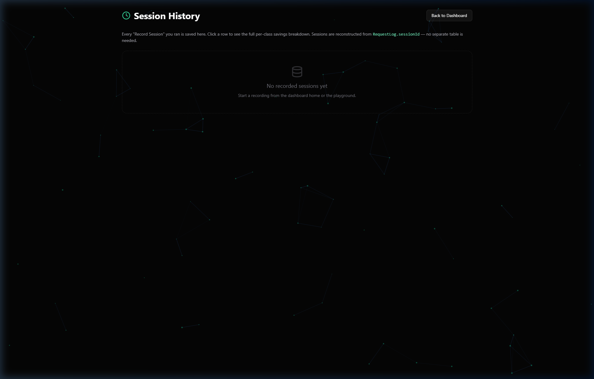
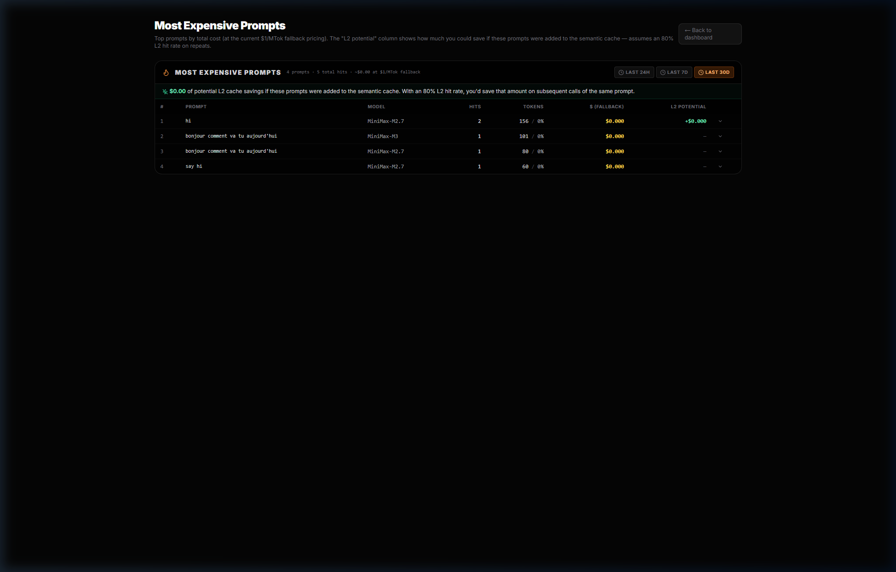
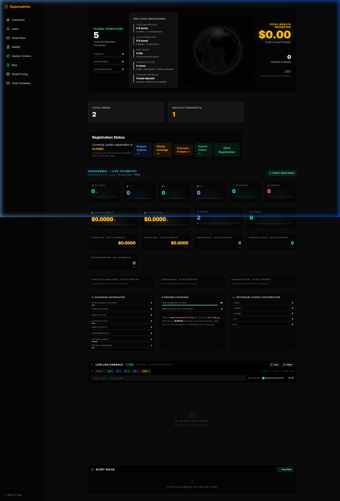
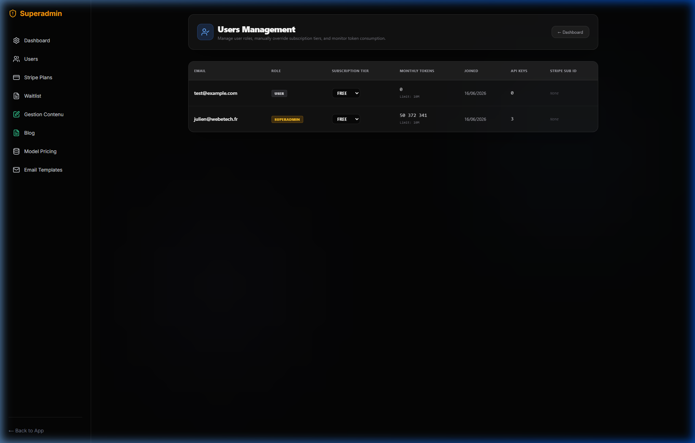
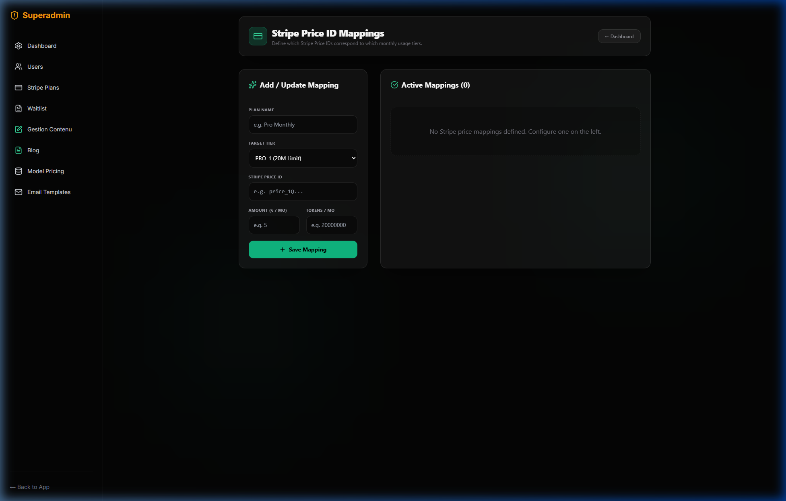
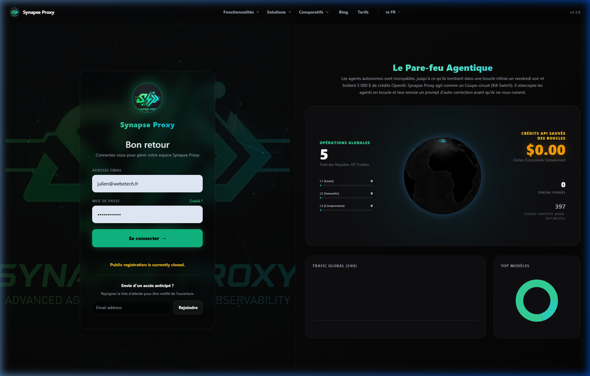

# Walkthrough — Refactoring Synapse Proxy

## Travail accompli

### Phase 1 : 4 bugs critiques fixés
- **BUG 1 — Variable shadowing `optResult`** (proxy.go) : Remplacé la variable locale par la variable globale de fonction pour éviter les payloads vides (erreur 2013).
- **BUG 1b — PayloadHash vide** : Ajout du calcul du hash et comptage de tokens en mode `EngineDisabled`.
- **BUG 2 — CCR pipeline ordering** : Correction de la priorité de `CCRCompressHook` de 800 à 740 pour qu'il s'exécute avant `CCRRetrieveHook` (750).
- **BUG 3 — finalResponseBytes nil** : Gestion propre du flux de réponse et garde-fou sur `resp`.

### Phase 2 : Documentation
- Création de `docs/GUIDE.md` (architecture, pipeline, administration, troubleshooting).

### Phase 3 : Correctifs Récents & Normalisation
- **models.go** : Correction du retour hâtif sur `lmstudio`.
- **proxy.go** : Suppression de la déclaration doublée de `case "lmstudio"`, correction de l'assignation de `targetURL`, correction du log de priorité de `CCRCompressHook` (740).
- **Compte Admin PostgreSQL** : Déduplication de l'email `admin@synapse.local`, activation de l'index unique `User_email_key` via Prisma, réinitialisation du mot de passe à `admin1234` sans corruption PowerShell.
- **Upstream MiniMax** : Migration vers `/v1/chat/completions` (OpenAI-compatible).

### Phase 4 : Modularisation & Nettoyage
- **Découpage de `proxy.go`** : Création de [helpers.go](file:///g:/Optitoken/proxy/internal/handlers/helpers.go), [stream.go](file:///g:/Optitoken/proxy/internal/handlers/stream.go) et [benchmark.go](file:///g:/Optitoken/proxy/internal/handlers/benchmark.go).
- **Retrait du pipeline obsolète** : Nettoyage de `engine.go` (retrait de `ProcessRequest`), suppression d'`engine_switch.go` et de `SYNAPSE_DISABLE_OLD_ENGINE`.

### Phase 5 : Stabilisation E2E & Correction du Pipeline des Hooks
- **Correction de `RunAfterHooks`** : Réassignation de `hctx.UpstreamResponse` lors des mutations de hooks pour propager les changements.
- **Stabilisation E2E** : Utilisation de prompts avec nonce dynamique et option `bypass_cache` pour éviter les interférences sémantiques ou le détecteur de boucles.

### Phase 6 : Algorithmes de Compression Avancés (Headroom)
- **SmartCrusherHook (720)** : Compaction lossless CSV si gain >15%, sinon row-drop lossy (30% début / 15% fin) avec sentinel `_ccr_dropped` et archivage.
- **DiffCompressorHook (730)** : Élision des lignes de contexte de hunks à plus de 2 lignes d'une modification, et déchargement dans le CCR si >50 lignes.
- **ASTCodeCompressorHook (760)** : Suppression du corps des fonctions de plus de 5 lignes pour le Python, Go, JS/TS et remplacement par des commentaires d'élision.

### Phase 7 : Serveur MCP Unifié & Cache Alignement
- **Exécution In-Process** : Remplacement de l'appel HTTP loopback vers le port `8080` de l'outil `synapse_chat_completions` par une invocation directe et en mémoire via `httptest.NewRecorder()` et `handlers.ProxyHandler`.
- **Unification des outils de cache L3 (CCR)** : Ajout de `synapse_inspect_ccr_store`, `synapse_get_ccr_value` et `synapse_optimize_prompt`.
- **Auto-Prompt Caching (Anthropic)** : Hook injectant `"cache_control": {"type": "ephemeral"}` sur le system prompt, la liste d'outils et le message assistant à `len(messages) - 2`.

### Phase 8 : Interface Dashboard, Stats Globales & Mise en Page (Nouveau)

#### 1. Amélioration de la Visualisation de Flux (User Dashboard)
* **[TokenFlowAnimation.tsx](file:///g:/Optitoken/dashboard/components/TokenFlowAnimation.tsx)** : 
  * Les particules animées changent de couleur et de lueur (box shadow) selon un parcours fluide (violet `#c084fc` en entrée, vert `#34d399` au centre, cyan `#22d3ee` en sortie).
  * La taille (`scale`) des particules a été modifiée pour démarrer grosse (`2.5` fois la taille de base) en entrée et finir très petite (`0.4` fois) en sortie.
  * La couleur d'entrée du chemin SVG a été harmonisée en violet (`#c084fc`).

#### 2. Clarification des Libellés de Jetons
* **[TokenFlowAnimation.tsx](file:///g:/Optitoken/dashboard/components/TokenFlowAnimation.tsx)** : Remplacement du terme ambigu `OUT` dans le cadre de droite par `OPT.` (Optimized) et le libellé au-dessus par `Optimized Prompt` (Prompt Optimisé), levant toute ambiguïté avec les jetons de complétion.

#### 3. Résolution du Bug des Stats Globales à 0 (Superadmin)
* **[status/route.ts](file:///g:/Optitoken/dashboard/app/api/admin/status/route.ts)** : Ajout de la fonction `parseLabels` pour parser proprement les labels Prometheus de type `key="value"`. Le parseur extrait désormais la valeur brute du label primaire (ex. `"L1"`, `"L2"`, `"L3"`, `"le_10ms"`) et l'utilise directement comme clé de stockage des échantillons.
* **[ServerHealthCard.tsx](file:///g:/Optitoken/dashboard/components/ServerHealthCard.tsx)** : 
  * Prise en charge des buckets de latence sans guillemets doubles. Les jauges de cache (L1, L2, L3) et de latence affichent à présent leurs valeurs réelles.
  * Modification du format de `$ Saved (DB)` de `.toFixed(0)` à `.toFixed(4)` pour rendre visible les micro-économies cumulées.

#### 4. Résolution du Débordement Visuel du Globe
* **[GlobalCommandCenter.tsx](file:///g:/Optitoken/dashboard/components/GlobalCommandCenter.tsx)** : 
  * La taille du globe a été réduite de `600px` à `400px` (desktop) et `300px` (mobile).
  * Utilisation d'un drapage flex responsive (`flex-col xl:flex-row gap-8`) pour forcer l'empilage vertical sur les écrans intermédiaires (tablettes, ordinateurs portables ordinaires) et horizontal uniquement sur les très grands écrans (supérieurs à 1280px). Le widget ne subit plus aucune coupure ou troncature.

### Phase 9 : Débugger Visuel de Pipeline de Requête (Side-by-Side Diff)
* **Débugger Visuel (RequestExplorer.tsx)** :
  * Ajout d'un nouvel onglet principal `"Visual Pipeline"` s'affichant en premier lors de l'inspection d'une requête.
  * Implémentation d'un algorithme de calcul de différences LCS (Longest Common Subsequence) en JavaScript pur pour analyser et afficher les suppressions/ajouts entre le prompt initial et le prompt optimisé après compression.
  * Création d'un schéma de flux vertical interactif retraçant le parcours de la requête (Réception -> Compression avec nom du compresseur -> Cache Lookup L1/L2/L3 avec nœud de hit surligné en vert -> Envoi upstream/Résolution).
  * Affichage en entête des gains cumulés (coût économisé, estimation du temps réseau économisé).

### Phase 10 : Télémétrie 3D et Matrice Hook en Temps Réel (Wow Effect)
* **Télémétrie 3D (GlobalCommandCenter.tsx & route.ts)** :
  * Calcul et tracé d'arcs de routage dynamiques reliant la position de l'utilisateur (IP randomisée), le serveur proxy (Francfort) et les serveurs du fournisseur cible (ex: Chicago pour OpenAI, Virginie pour Anthropic, Singapour/Pékin pour MiniMax).
  * Différenciation visuelle : en cas de cache hit, l'arc s'arrête au proxy (couleur verte/violette, vitesse d'animation doublée). En cas de cache miss, l'arc poursuit vers le fournisseur cible (couleur rouge/orange, vitesse normale).
  * Les requêtes créent des arcs filants éphémères qui s'effacent automatiquement après 4 secondes.
* **Matrice Hook en Temps Réel (GlobalCommandCenter.tsx)** :
  * Intégration d'une grille néon interactive représentant chaque hook de traitement (`L1`, `L2`, `L3`, `SmartCrusher`, `Diff Compressor`, `AST Compactor`).
  * À chaque nouvelle requête reçue en SSE, une onde lumineuse séquentielle anime les cartes en affichant l'état de passage (Vert = Hit, Rouge = Miss, Violet = Compresseur activé).
  * Connexion de la vue d'ensemble des statistiques de la page d'administration au flux temps réel (`/api/admin/logs/stream`). Les compteurs de requêtes et d'économies de tokens/argent grimpent en direct.

### Phase 11 : Polish UX - Sélecteur de Clé Global & Unification des Headers
* **Sélecteur de Clé Virtuelle Global (page.tsx)** :
  * Intégration d'un filtre global sous forme de sélecteur épuré en haut de la section statistique.
  * Permet de filtrer en temps réel l'intégralité des indicateurs de la page utilisateur (Jauges, Graphique de valeur sauvée, Taux de compression) par clé virtuelle spécifique ou de visualiser la consommation cumulée du compte.
* **Unification des Headers Publics (PublicHeader.tsx & 17 pages associées)** :
  * Extraction et centralisation de la barre de navigation dans un composant réutilisable unique `PublicHeader.tsx`.
  * Support d'un mode `floating` fixe avec effet de flou pour les pages d'accueil, blog et plans, et d'un mode statique s'intégrant au flux pour les pages détaillées de fonctionnalités.
  * Suppression de près de 300 lignes de code CSS/HTML dupliquées pour une cohérence graphique parfaite.

### Phase 12 : Sandbox Client Local Windows (`.exe` autonome)
* **Création d'un Sous-Dossier Isolé (`local-client/`)** :
  * Initialisation d'un module Go séparé (`synapse-local`) pour préserver la structure principale intacte.
* **Moteur SQLite & Caching Hybride** :
  * Intégration d'un pilote SQLite sans CGO (`github.com/glebarez/go-sqlite`) pour une compilation multiplateforme facile.
  * Implémentation de caches L1 (requêtes exactes), L2 (Jaccard sémantique de mots-clés local) et L3 (simulé) sur SQLite.
* **DRM de Licence & Quotas** :
  * Système de décodage local de licences par préfixes (`FREE-`, `PRO-`, `ENT-`).
  * Background worker effectuant un heartbeat toutes les 10 minutes pour synchroniser les quotas consommés avec l'API cloud.
* **Dashboard Statique Embarqué** :
  * Configuration du serveur d'assets via `go:embed` pour servir le dashboard Next.js sur le port unique **`4321`** et le proxy de routage sur le port **`8080`**.
* **Intégration d'Ollama & LM Studio avec Liste de Modèles Dynamique** :
  * Ajout de profils pré-remplis pour Ollama (`http://localhost:11434`) et LM Studio (`http://localhost:1234`).
  * Récupération automatique de la liste des modèles locaux installés via l'interrogation dynamique de leurs API locales.
  * Ajout de guides visuels et d'exemples d'intégration pour **Claude Code** et **Cursor** dans l'onboarding.

## Galerie de Capture d'Écran (Walkthrough de Production)

Pour votre documentation d'onboarding et de présentation, vous trouverez ci-dessous une galerie interactive de toutes les sections de l'application de production. 

Une vidéo d'enregistrement complète des actions de navigation de l'agent est disponible ici :

<video src="docs/assets/production_tour_walkthrough_1782571374611.webp" controls width="100%"></video>

````carousel

<!-- slide -->

<!-- slide -->

<!-- slide -->

<!-- slide -->

<!-- slide -->

<!-- slide -->

<!-- slide -->

<!-- slide -->

````

